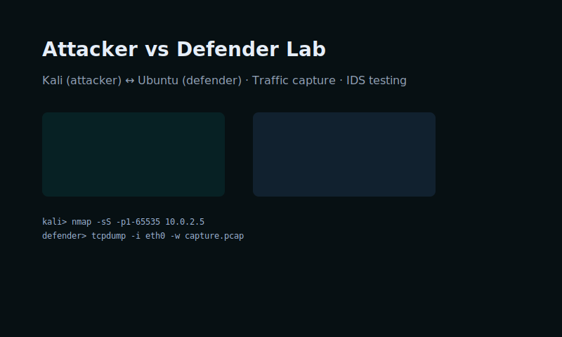

# Mac Tsui

Aspiring Cybersecurity Specialist

 
<link rel="stylesheet" href="assets/css/styles.css">

## Projects

### 1. IDS Network Analysis

I used Suricata and Snort on a Linux VM to collect and analyze network logs. This project demonstrates how to monitor, detect, and respond to threats, and documents ways to improve system resilience.

<a class="project-btn" href="projects/ids-analysis/">View Project</a>

### 2. Attacker vs Defender Virtual Lab

A two-VM environment (Kali attacker & Ubuntu defender) used to simulate scanning, detection, traffic logging, and defensive response techniques.

<a class="project-btn" href="projects/attacker-vs-defender-lab/">View Project</a>

### 3. Tech Shop Network

A demonstration of a technology retail network and website deployment (hosted via IONOS and related tools). It includes notes on site setup, integration, and promotional strategies.

<a class="project-btn" href="projects/tech-shop-network/">View Project</a>

---

## CV

Download: 

## Contact

- **Email:** <macbluetsui@icloud.com>
- **GitHub:** [Opening0](https://github.com/Opening0)
- **Phone Number** 07476852370

